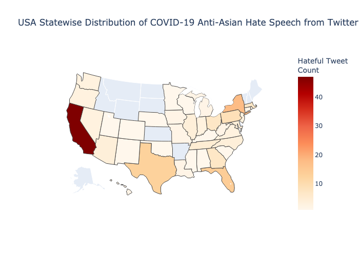

# COVID-19 Anti-Asian Racism Hate Speech Detection using Transfer Learning

Since the start of the COVID-19 pandemic, there has been a widespread increase in the amount of hate-speech being propagated online against the Asian community. 
This project builds upon and explores the work of [He et al.](https://arxiv.org/abs/2005.12423) 
Their COVID-HATE dataset contains 206 million tweets focused around anti-Asian hate speech. 
Using tweet data from before the COVID-19 pandemic, as well as the COVID-HATE dataset from He et al, we performed transfer learning. 
We tested several different models, including BERT, RoBERTa, LSTM, and BERT-CNN.  
Some of these models hindered the performance of He et al’s model, while others improved it. 

You can access the original proposal here: [Proposal](docs/proposal.md)

You can access the full report here: [Report](docs/report.pdf)

We also explored the geographical extent of the ani-Asain tweets from the COVID-HATE dataset.

Since a large majority of the tweets originated from U.S.A., here is a map showing the distribution within this country.

